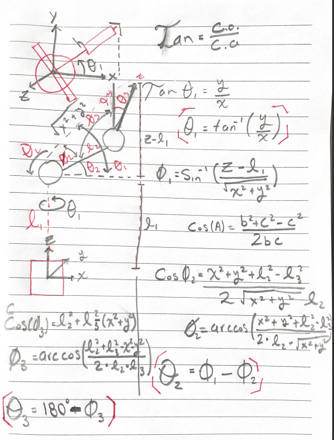
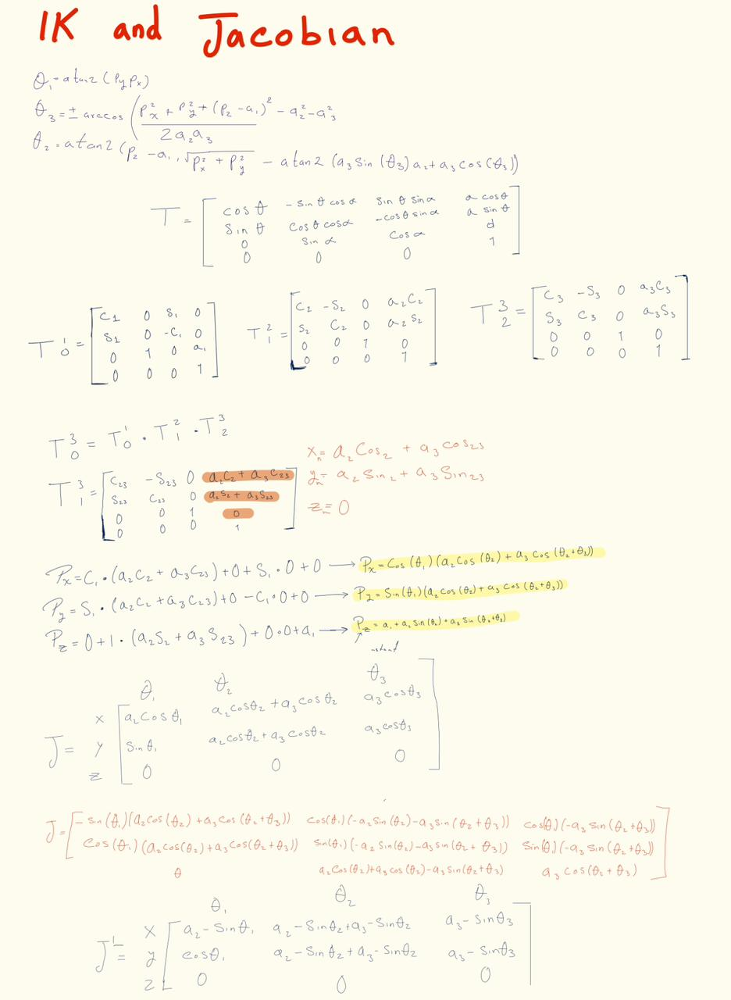

# IK and jacobian

## 1. Graphical Results
This section will display the graphical results obtained from the above equations:

---

## 2. Observations
- We used **trigonometric functions** to deduce the necessary relations in the kinematics.
- We also applied the **law of cosines** to calculate the angles \( \varphi_1 \) and \( \varphi_2 \).
- With these values, it was possible to determine the joint angles \( \theta_2 \) and \( \theta_3 \).
