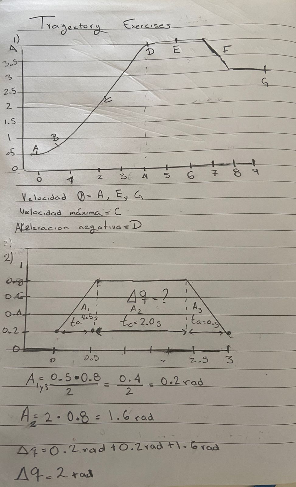
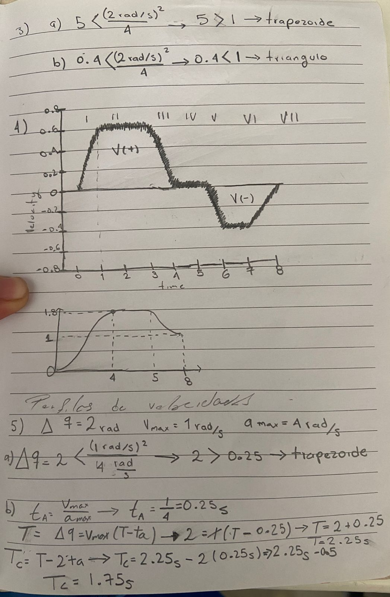
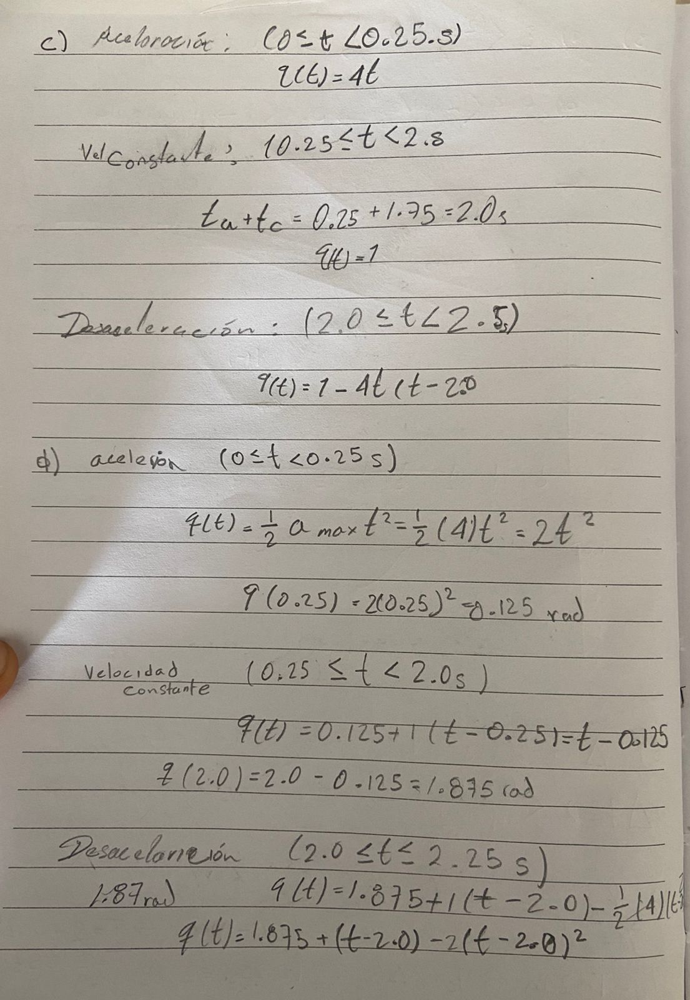
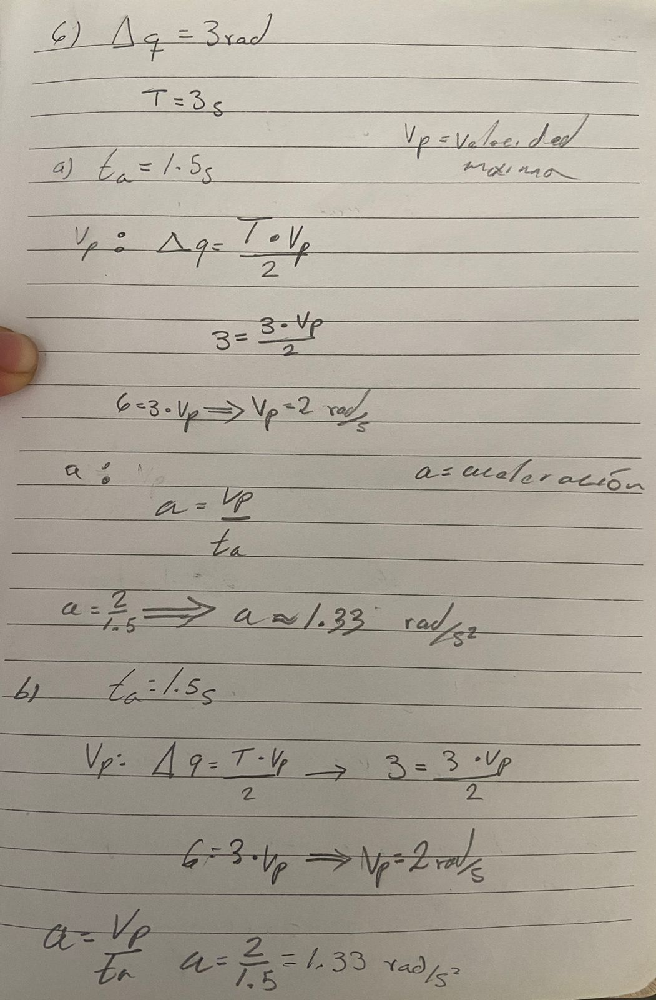
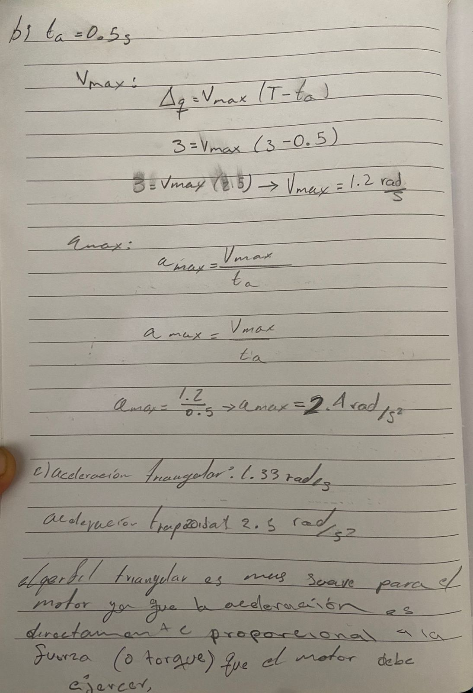

# Activity : Trajectory Planning II: Linear Cartesian Trajectories
- **Team:** Isaac Antonio Pérez Alemán & Carlos Galicia

This activity focuses on replicating **five robots** within a simple 3D environment in Linux, using the **Unified Robot Description Format (URDF)**.  
The main objective is to simulate robot motion by combining three basic geometric shapes:

- **Cylinder**
- **Cube**
- **Sphere**

## URDF Model Features
- Each robot is defined in its **own URDF file**.
- The models include **joints**, **links**, and **motion limits** to achieve realistic simulation.
- A dedicated **launch configuration** is provided for execution.
- **Visualization screenshots** are generated to illustrate robot behavior in the simulated environment.

### Code 5

