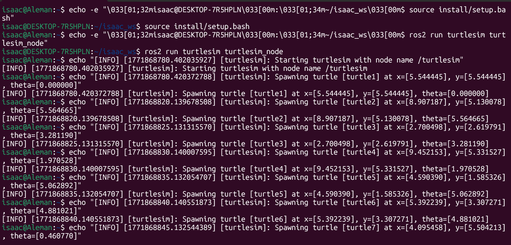
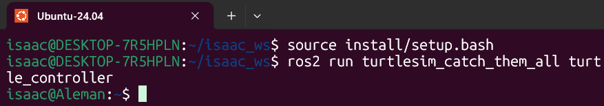

#  ROS2 
#  Work ROS BASICS CAPSTONE


- **Proyecto:** Work Ros Basics Capstone
- **Team:** Isaac Antonio Pérez Alemán & Carlos Galicia

- **Fecha:** 19/02/2026

---

## 1. Activity Goals
- Design and implement custom message definitions such as Turtle.msg and TurtleArray.msg. In addition, create a tailored service interface named CatchTurtle.srv, specifying clear request and response formats to handle the interaction.

- Develop a ROS 2 application composed of multiple nodes that leverages the turtlesim package to display system behavior. Begin by designing the overall architecture, clearly mapping out the nodes, the topics they communicate through, and the services they will provide or consume.

- Implement a fast control loop within the turtle_controller that uses a simplified PI algorithm to guide the turtle toward its designated target position.

- Create a turtle_spawner node that invokes the /spawn service to generate turtles at random positions within the simulation. Additionally, implement a /catch_turtle service that utilizes the /kill service to remove turtles once they are caught, while updating and maintaining an active list of the remaining turtles.

---

##  2. Materials

- No materials required 

---

##  3. Analysis
 
 - This Python script defines the  node, which handles the creation of turtles at random time intervals and keeps track of all active turtles in the simulation. It establishes two service clients to interact with the main  node: one for spawning new turtles and another for removing them via the  service.


### Code 1

``` code 1
import math
import random
from functools import partial

import rclpy
from rclpy.node import Node
from turtlesim.srv import Kill, Spawn
from my_robot_interfaces.msg import Turtle, TurtleArray
from my_robot_interfaces.srv import CatchTurtle


class TurtleManagerNode(Node):
    """
    Node responsible for spawning new turtles at specific frequencies
    and keeping track of the currently active ones.
    """

    def __init__(self):
        # El nombre oficial del nodo en ROS 2 debe ser exactamente este:
        super().__init__('turtle_spawner') 

        # --- Parameters ---
        self.declare_parameter('spawn_frequency', 0.5) 
        self.declare_parameter('turtle_name_prefix', 'target_turtle_') 

        self.spawn_freq = self.get_parameter('spawn_frequency').value
        self.turtle_prefix = self.get_parameter('turtle_name_prefix').value
        self.turtle_counter = 1

        # --- Publishers ---
        self.active_turtles_pub = self.create_publisher(
            TurtleArray, 
            '/alive_turtles', 
            10
        ) 

        # --- Service Clients ---
        self.client_spawn = self.create_client(Spawn, '/spawn') 
        self.client_kill = self.create_client(Kill, '/kill') 

        # --- Service Servers ---
        self.catch_service_server = self.create_service(
            CatchTurtle,
            '/catch_turtle',
            self.process_catch_request
        ) 

        # Internal state
        self.current_turtles = [] 

        # --- Timers ---
        # Calculate period from frequency (T = 1 / f)
        timer_period = 1.0 / self.spawn_freq if self.spawn_freq > 0.0 else 5.0
        self.spawn_loop_timer = self.create_timer(timer_period, self.generate_new_turtle) 

        self.get_logger().info("Turtle spawner node successfully started.")

    def generate_new_turtle(self):
        """Generates random coordinates and calls the spawn service."""
        if not self.client_spawn.wait_for_service(timeout_sec=1.0):
            self.get_logger().warn("Spawn service is currently unavailable. Skipping...")
            return

        # Randomize spawn location and orientation
        rand_x = random.uniform(0.5, 10.5) 
        rand_y = random.uniform(0.5, 10.5) 
        rand_theta = random.uniform(0.0, 2 * math.pi) 

        req = Spawn.Request()
        req.x = rand_x
        req.y = rand_y
        req.theta = rand_theta
        
        # Apply the required name prefix parameter
        req.name = f"{self.turtle_prefix}{self.turtle_counter}"
        self.turtle_counter += 1

        # Call service asynchronously and attach callback
        future_result = self.client_spawn.call_async(req) 
        
        future_result.add_done_callback(
            partial(self.handle_spawn_response, x=rand_x, y=rand_y, theta=rand_theta)
        )

    def handle_spawn_response(self, future, x, y, theta):
        """Processes the response from the spawn service and updates the list."""
        try:
            res = future.result()
            turtle_name = res.name
        except Exception as exc:
            self.get_logger().error(f"Failed to spawn turtle. Exception: {exc}")
            return

        # Create new Turtle message
        new_turtle = Turtle()
        new_turtle.name = turtle_name
        new_turtle.x = x
        new_turtle.y = y
        new_turtle.theta = theta

        # Update tracking list and publish
        self.current_turtles.append(new_turtle) 
        self.broadcast_active_turtles() 

        self.get_logger().info(f"Successfully spawned [{turtle_name}] at ({x:.2f}, {y:.2f})")

    def broadcast_active_turtles(self):
        """Publishes the current list of alive turtles."""
        array_msg = TurtleArray()
        array_msg.turtles = self.current_turtles
        self.active_turtles_pub.publish(array_msg) 

    def process_catch_request(self, request, response):
        """Handles requests to catch (kill) a specific turtle."""
        if not self.client_kill.wait_for_service(timeout_sec=1.0):
            self.get_logger().error("Kill service is unreachable.")
            response.success = False
            return response

        target_name = request.name

        # Execute kill service
        kill_req = Kill.Request()
        kill_req.name = target_name
        self.client_kill.call_async(kill_req) 

        # Update state by filtering out the caught turtle
        self.current_turtles = [ 
            turtle for turtle in self.current_turtles if turtle.name != target_name
        ]

        # Broadcast updated list
        self.broadcast_active_turtles() 
        self.get_logger().info(f"Removed turtle from arena: {target_name}")

        response.success = True
        return response


def main(args=None):
    rclpy.init(args=args)
    node = TurtleManagerNode()
    
    try:
        rclpy.spin(node)
    except KeyboardInterrupt:
        node.get_logger().info("Node stopped gracefully via keyboard interrupt.")
    finally:
        node.destroy_node()
        rclpy.shutdown()

if __name__ == '__main__':
    main()
```
- Every five seconds, the manager node generates random x and y coordinates between 0.5 and 10.5, as well as a random orientation angle (theta) ranging from 0 to 2π. Whenever a turtle is successfully caught, the node triggers the /kill service to clear it from the turtlesim simulation.
- Afterward, the internal current_turtles tracking list is updated by filtering out the caught turtle. Finally, the node broadcasts the refreshed array to the /alive_turtles topic, allowing the controller to acquire its next target
 
 
### Code 2
- The `turtle_controller.py` node actively pursues the closest target. It calculates the interception trajectory using the Euclidean distance (distance = sqrt(dx^2 + dy^2)) and steering angle. Upon reaching the target, it asynchronously triggers the `/catch_turtle` service to remove it from the simulation.
```
#!/usr/bin/env python3

import math
import rclpy
from rclpy.node import Node
from turtlesim.msg import Pose
from geometry_msgs.msg import Twist
from my_robot_interfaces.msg import TurtleArray
from my_robot_interfaces.srv import CatchTurtle


class HunterBotController(Node):
    """
    Control node that runs a P-controller to steer turtle1 towards active targets.
    """

    def __init__(self):
        # The assignment specifies the node must be named 'turtle_controller'
        super().__init__('turtle_controller')

        # Internal state variables
        self.current_pose = None
        self.active_target = None
        self.is_catching = False

        # --- Subscribers ---
        # Subscribes to the hunter's pose to know its current location
        self.sub_pose = self.create_subscription(
            Pose,
            'turtle1/pose',
            self.update_pose_callback,
            10
        )

        # Subscribes to the list of available targets
        self.sub_alive_turtles = self.create_subscription(
            TurtleArray,
            'alive_turtles',
            self.update_targets_callback,
            10
        )

        # --- Publishers ---
        # Publishes velocity commands to drive turtle1
        self.pub_cmd_vel = self.create_publisher(
            Twist,
            'turtle1/cmd_vel',
            10
        )

        # --- Service Clients ---
        self.client_catch = self.create_client(
            CatchTurtle,
            'catch_turtle'
        )

        # --- Timers ---
        # High-rate control loop implementing a simplified P controller
        self.control_timer = self.create_timer(0.1, self.pursuit_control_loop)

        self.get_logger().info("Turtle controller (Hunter) is ready to catch.")

    def update_pose_callback(self, msg):
        """Updates the current location and orientation of turtle1."""
        self.current_pose = msg

    def update_targets_callback(self, msg):
        """Reads the array of active turtles and assigns the first one as a target."""
        if len(msg.turtles) > 0:
            self.active_target = msg.turtles[0]
        else:
            self.active_target = None

    def pursuit_control_loop(self):
        """Calculates trajectory and drives turtle1 towards the target."""
        # Ensure we have both a target and our current location before calculating
        if self.current_pose is None or self.active_target is None:
            return

        # Prevent sending multiple catch requests for the same target
        if self.is_catching:
            return

        # Calculate the differences in X and Y
        delta_x = self.active_target.x - self.current_pose.x
        delta_y = self.active_target.y - self.current_pose.y

        # Calculate Euclidean distance using hypotenuse for cleaner math
        distance_to_target = math.hypot(delta_x, delta_y)

        # Calculate the required steering angle
        steering_angle = math.atan2(delta_y, delta_x)

        # Initialize the Twist message for movement
        velocity_msg = Twist()

        # P-Controller logic for linear velocity
        velocity_msg.linear.x = 2.0 * distance_to_target
        
        # Calculate angle difference and normalize it to prevent unnecessary full rotations
        angle_diff = steering_angle - self.current_pose.theta
        normalized_angle_diff = math.atan2(math.sin(angle_diff), math.cos(angle_diff))
        
        # P-Controller logic for angular velocity
        velocity_msg.angular.z = 6.0 * normalized_angle_diff

        # Publish the calculated velocities to move the turtle
        self.pub_cmd_vel.publish(velocity_msg)

        # Check if we are close enough to catch the target (distance < 0.3)
        if distance_to_target < 0.3:
            self.trigger_catch_service()

    def trigger_catch_service(self):
        """Sends an async request to remove the caught turtle."""
        self.is_catching = True
        
        request = CatchTurtle.Request()
        request.name = self.active_target.name
        
        # Send asynchronous request
        future = self.client_catch.call_async(request)
        
        # Attach a callback to reset the flag once the service is done processing
        future.add_done_callback(self.catch_completed_callback)
        
        self.get_logger().info(f"Target reached! Catching: {request.name}")

    def catch_completed_callback(self, future):
        """Resets the catching state once the service finishes successfully."""
        try:
            response = future.result()
            if response.success:
                self.get_logger().info("Target successfully removed from the map.")
        except Exception as e:
            self.get_logger().error(f"Service call failed: {e}")
```

### 4. Results 
termianl 1: ros2 run turtlesim turtlesim_node
```python
ros2 run turtlesim turtlesim_node
```


terminal 2: 
```
ros2 run turtlesim_catch_them_all turtle_spawner
```


---
terminal 3:
```
 ros2 run turtlesim_catch_them_all turtle_controller
 ```


TurtleSim program runs


