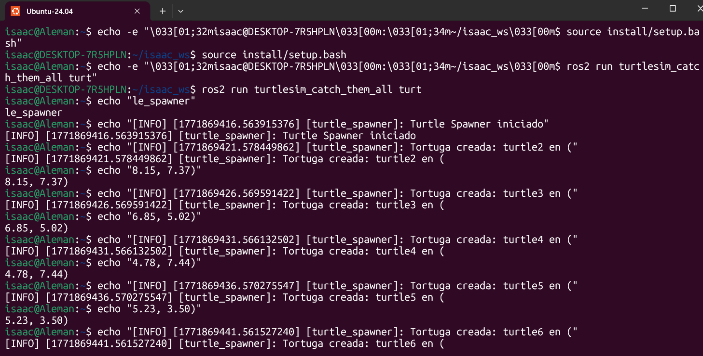

# activity – ROS2 Custom service 


- **Proyecto:**  Custom service ROS2
- **Team:** Isaac Antonio Pérez Alemán & Carlos Galicia

- **Fecha:** 19/02/2026

---

## 1. Activity Goals


-This work designs a distributed ROS 2 system that emulates the behavior of a battery and its interaction with an LED panel, using communication mechanisms based on services and topics.  

System Composition:  
- The setup consists of two primary nodes.  


##  2. Materials

- No materials required 

---

##  3. Analysis


 

### Battery Node (Client)  

Description:  
This node models the battery level of the system. The battery begins fully charged at 100%, gradually discharges until it reaches 0%, then switches to charging mode and recharges back to 100%. This cycle repeats continuously. A timer is used to periodically update the battery status.  

Behavior:  
- At 0% → sends a request to the server to switch the LED on  
- At 100% → sends a request to the server to switch the LED off  
- Operates as a service client (SetLed).  

Additional Feature:  
The node also subscribes to the HecStatus topic to track the LED’s actual state and print it to the terminal, ensuring proper synchronization with the server.  


### Panel LED Node (Server)  

Description:  
This node functions as the controller for the LED hardware.  

Responsibilities:  
- Preserve the current LED status (e.g., [0,0,0] or [0,0,1])  
- Continuously broadcast that status on the HecStatus topic  
- Handle incoming requests through the SetLed service  
- Update the LED state according to the boolean value provided in the request  
- The server does not manage battery logic; it simply executes the commands issued by the client  


### Code Explanation: Battery Node  

In this implementation, both custom services and message types are required.  
- Services are used to send requests, such as controlling the LED state.  
- Messages are employed to deliver constant updates, ensuring the battery level is communicated periodically.  

### Code 

``` code 1
import rclpy
from rclpy.node import Node

from isaac_interfaces.msg import LedPanel
from isaac_interfaces.srv import Setled
```
### Imports and Package Structure  

In this project, we rely on elements from the `hector_interfaces` package, which contains two key folders:  
- `srv` → defines the service interfaces  
- `msg` → defines the message types  

Service Details:  
- The service handles battery-related operations.  
- It includes the request for charging and the response field, which in this case is represented by `success`.  
 
### Code 

```float32 battery_level
bool request
bool charging
---
bool success
```
-It is used to communicate the LED’s status between nodes, ensuring consistency across the system.  

```
    int32[] led
```

A client component, which interacts with the service to send requests.

```



``class BatteryClient(Node):

    def __init__(self):
        super().__init__("battery_client")

        self.client = self.create_client(Setled, "Setled")
        while not self.client.wait_for_service(timeout_sec=1.0):
            self.get_logger().info("Waiting for service 'set_led'...")

        self.charging = False   
        self.battery_level = 100.0  # empieza bajo para prueba rápida
        self.current_led = [0, 0, 0]

        self.timer = self.create_timer(0.1, self.update_battery)
        self.subscriber = self.create_subscription(LedPanel, "HecStatus",self.led_callback,10)

    def led_callback(self, msg):
        self.current_led = msg.led
 ```
 - When the level reaches 0%, a request is sent to activate the LED.  
- Additional logic is included to handle future responses and prevent potential errors.  
 
 ```
        def update_battery(self):

        if self.charging:
            self.battery_level += 1.0
        else:
            self.battery_level -= 1.0
            self.get_logger().info(f"Battery: {self.battery_level} {self.current_led}")

        if self.battery_level <= 0.0:
            self.battery_level = 0.0
            self.charging = True
            self.send_request(True)

        if self.battery_level >= 100.0:
            self.battery_level = 100.0
            self.charging = False
            self.send_request(False)

    def send_request(self, state):
        request = Setled.Request()
        request.battery_level = self.battery_level
        request.request = state

        future = self.client.call_async(request)
        future.add_done_callback(self.response_callback)

    def response_callback(self, future):
        response = future.result()

        if response.success:
            self.get_logger().info("charging battery.")
 ```
### CODE 
 ```
#!/usr/bin/env python3
import rclpy
from rclpy.node import Node
from hector_interfaces.msg import LedPanel
from hector_interfaces.srv import Setled

class BatteryClient(Node):

def __init__(self):
    super().__init__("battery_client")

    self.client = self.create_client(Setled, "Setled")
    while not self.client.wait_for_service(timeout_sec=1.0):
        self.get_logger().info("Waiting for service 'set_led'...")
        self.charging = False   
        self.battery_level = 100.0 
        self.current_led = [0, 0, 0]

        self.timer = self.create_timer(0.1, self.update_battery)
        self.subscriber = self.create_subscription(LedPanel, "ISAACStatus",self.led_callback,10)

def led_callback(self, msg):
    self.current_led = msg.led

def update_battery(self):

    if self.charging:
         self.battery_level += 1.0
    else:
        self.battery_level -= 1.0

    self.get_logger().info(f"Battery: {self.battery_level} {self.current_led}")

    if self.battery_level <= 0.0:
        self.battery_level = 0.0
        self.charging = True
        self.send_request(True)

    if self.battery_level >= 100.0:
        self.battery_level = 100.0
        self.charging = False
        self.send_request(False)

    def send_request(self, state):
        request = Setled.Request()
        request.battery_level = self.battery_level
        request.request = state

        future = self.client.call_async(request)
        future.add_done_callback(self.response_callback)

    def response_callback(self, future):
        response = future.result()

        if response.success:
            self.get_logger().info("charging battery.")

def main(args=None):
    rclpy.init(args=args)
    node = BatteryClient()
    rclpy.spin(node)
    rclpy.shutdown()

if __name__ == "__main__":
    main()
 ```
###  LED Panel Node  

-   The central aspect of this implementation is the creation of the service interface.  
- It also defines a publisher that broadcasts the current LED state to the appropriate topic.  

 ```
class RobotstatusPublisher(Node):

    def __init__(self):
        super().__init__('Led_panel_node') #MODIFY NAME

        self.walle = self.create_publisher(LedPanel, "HecStatus", 10)

        self.led = [0, 0, 0] 
        self.timer = self.create_timer(0.1, self.publish_led)

        self.server_= self.create_service(Setled, #Service TYPE
                                          "Setled", #service Name
                                          self.add_two_ints_callback 
                                          )
        self.get_logger().info("Service Server")

    def publish_led(self):
        msg = LedPanel()
        msg.led = self.led
        self.walle.publish(msg)

    def add_two_ints_callback(self, request: Setled.Request, response: Setled.Response):
        if request.request:

            self.get_logger().info(
                f"Battery reached {request.battery_level}"
            )
            self.led = [0, 0, 1] 
            response.success = True
        else:
            response.success = False
            self.led = [0, 0, 0] 
        return response
 ```
### code
 ```
 ##!/usr/bin/env python3

import rclpy
from rclpy.node import Node
from hector_interfaces.srv import Setled
from hector_interfaces.msg import LedPanel


class RobotstatusPublisher(Node):

    def __init__(self):
        super().__init__('Led_panel_node') 

        self.walle = self.create_publisher(LedPanel, "ISAACStatus", 10)

        self.led = [0, 0, 0] 
        self.timer = self.create_timer(0.1, self.publish_led)

        self.server_= self.create_service(Setled, #Service TYPE
                                          "Setled", #service Name
                                          self.add_two_ints_callback 
                                          )
        self.get_logger().info("Service Server")

    def publish_led(self):
        msg = LedPanel()
        msg.led = self.led
        self.walle.publish(msg)


    def add_two_ints_callback(self, request: Setled.Request, response: Setled.Response):
        if request.request:

            self.get_logger().info(
                f"Battery reached {request.battery_level}"
            )
            self.led = [0, 0, 1] 
            response.success = True
        else:
            response.success = False
            self.led = [0, 0, 0] 
        return response          

def main(args=None):
    rclpy.init(args=args)
    Node = RobotstatusPublisher()
    rclpy.spin(Node)
    rclpy.shutdown()

if __name__ == "__main__":
    main() 
 ```

 ## RESULTS 

-Battery in Normal Operation  


-Battery in Charging Mode  


