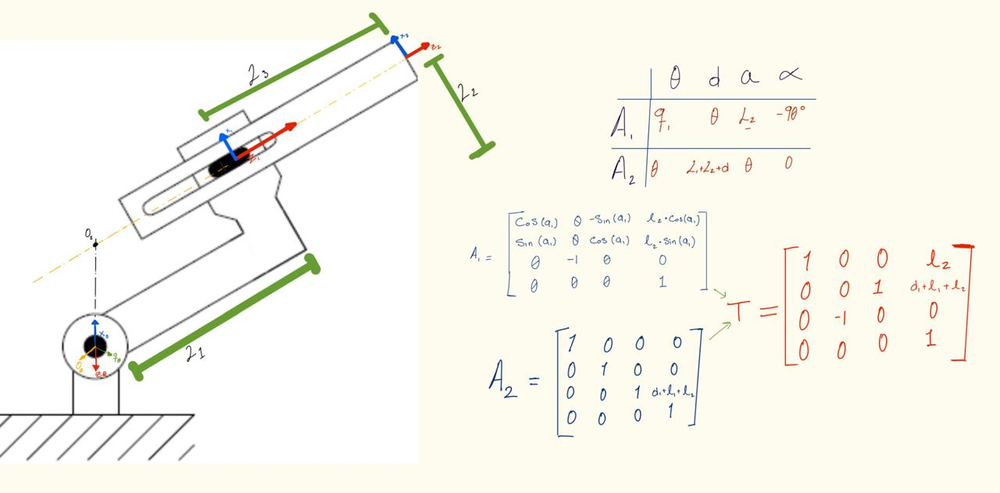
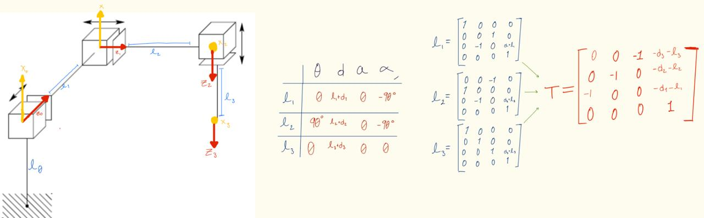
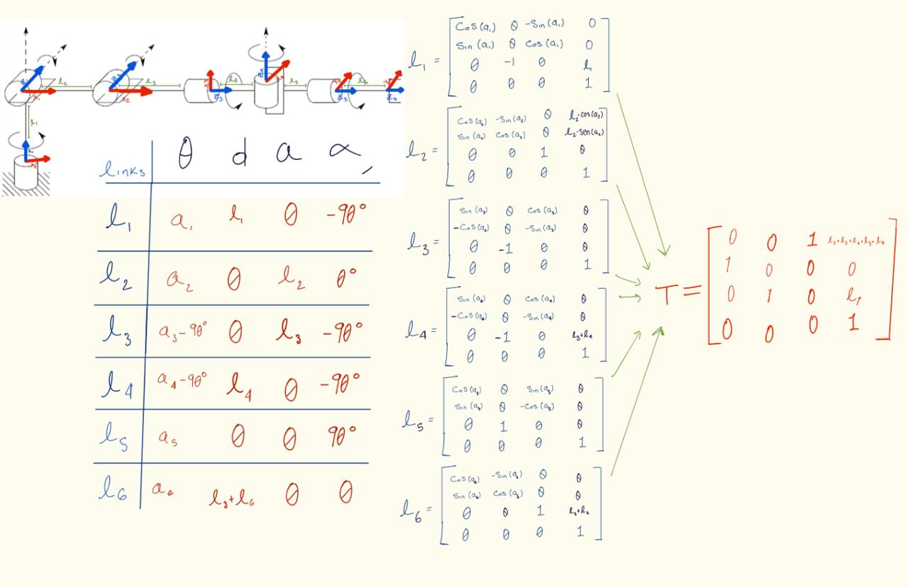
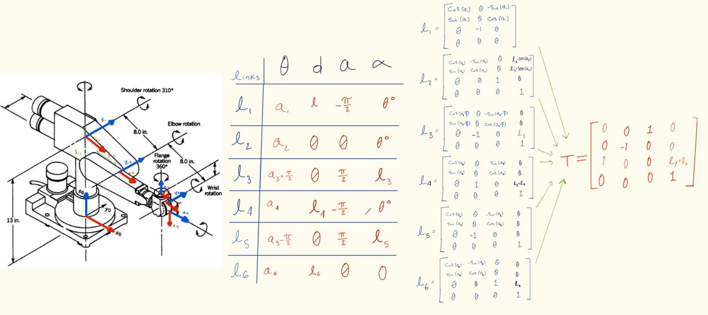
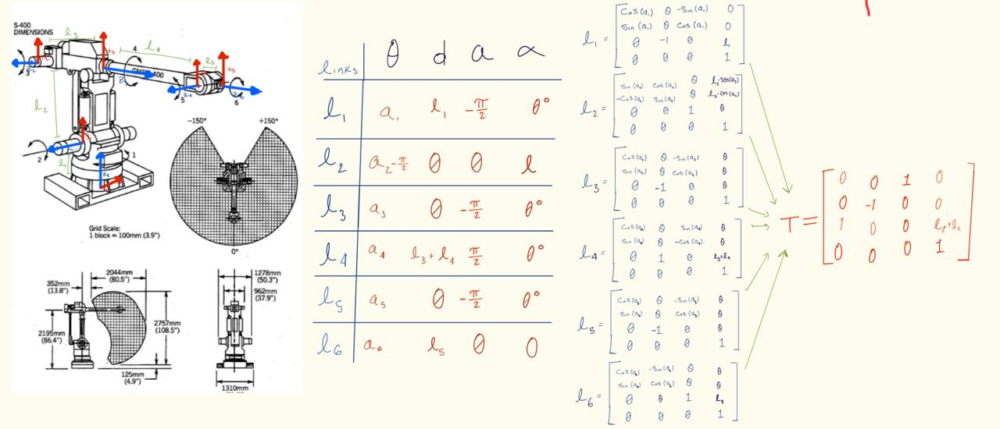

# Work 4: Forward Kinematics

- **Nombre del proyecto:** Work 4: Forward Kinematics
- **Equipo / Autor(es):** Isaac Antonio Perez Aleman
- **Curso / Asignatura:** Applied Robotics
- **Fecha:** 22/02/2026

## 1) Activity Goals
  - Correctly assign coordinate frames to each joint following the DH convention.
  - Identify the four specific parameters for each link.
  - Organize the extracted values into a standard DH parameter table to represent the robot's kinematic structure.

---
## 2) Materials
- No materials required. 
---

## 3) Analysis 

### Exercise 1
- **Descripción:** This exercise only has 2 movements: Prismatic and revolution (RP configuration).

### Exercise 2

- **Descripción:** For this exercise we have a robot with 3 prismatic movements and the tool.

### Exercise 3
- **Descripción:** For this exercise the robot has more movements than the last one, for that we have more joints, movements and a tool.

### Exercise 4
- **Descripción:** This exercise is a little confusing because we have movements, joints and tool, for that we can rewrite the robot for do more easy the analysis.

### Exercise 5
- **Descripción:** This exercise is the same to the last one, we have to rewrite the robot for do more easy the analysis.
 
 
