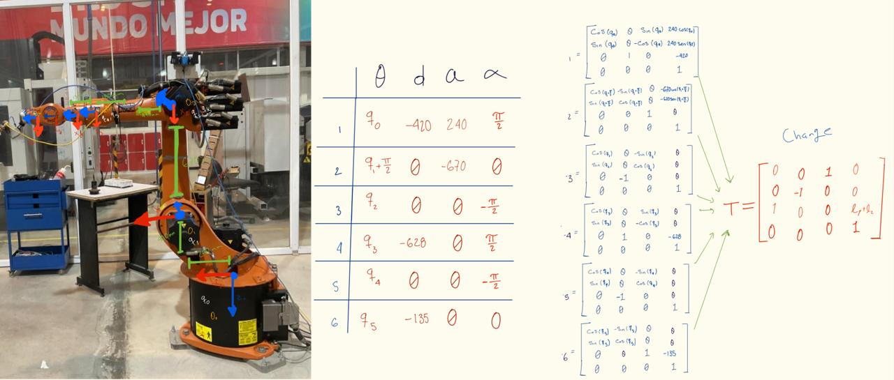
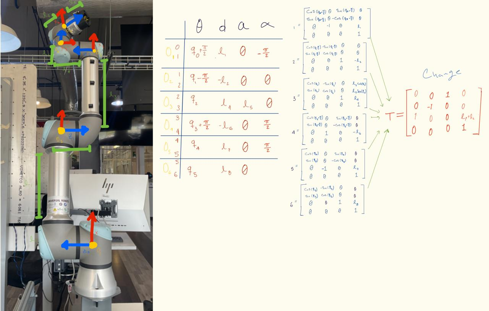

# Work: Forward Kinematics for KUKA and UR Robots


- **Nombre del proyecto:** Forward Kinematics for KUKA and UR Robots
- **Equipo / Autor(es):** Isaac Antonio Pérez Alemán
- **Curso / Asignatura:** Applied Robotics
- **Fecha:** 19/02/2026


## 1) Activity Goals

  - Correctly assign coordinate frames to each joint following the DH convention.
  - Identify the four specific parameters ($\theta, d, a, \alpha$) for each link.
  - Organize the extracted values into a standard DH parameter table to represent the robot's kinematic structure.
  - Get the DH parameters of each robot.
  - Know the kinematics of each robot.
  - Know how the movement is in each joint of the KUKA and UR robot, looking at how the manufacturer sets each positive turn.

---

## 2) Materials

- No materials required.

---

## 3) Analysis & Results 

### Exercise 1: KUKA Robot

- **Descripción:** This exercise only has 6 movements. All movements are revolution.

- **Metodology:** To make the analysis of the robot easier, we can rewrite (sketch) each joint and link.



- **Cálculo de la Matriz Final:**
  After getting the DH parameters table and the matrix of each link, we can compute the final matrix. For this step, we use a MATLAB Live Script to simplify the calculations.

### MATLAB Code

```matlab
%% CODE MATRIX FINAL - KUKA
syms q0 q1 q2 q3 q4 q5 real

% Definición de la tabla DH: [theta, d, a, alpha]
DH = [
    q0,          -420,  240,  pi/2;
    q1 + pi/2,      0, -670,     0;
    q2,             0,    0, -pi/2;
    q3,          -628,    0,  pi/2;
    q4,             0,    0, -pi/2;
    q5,          -135,    0,     0
];

% Inicialización de la matriz de transformación base
T_final = eye(4);

% Cálculo iterativo de las matrices de transformación homogénea
for i = 1:6
    th = DH(i,1); 
    d = DH(i,2); 
    a = DH(i,3); 
    al = DH(i,4);

    % Matriz de paso i-1 a i
    A = [cos(th), -sin(th)*cos(al),  sin(th)*sin(al), a*cos(th);
         sin(th),  cos(th)*cos(al), -cos(th)*sin(al), a*sin(th);
         0,        sin(al),          cos(al),         d;
         0,        0,                0,               1];

    % Multiplicación y simplificación simbólica
    T_final = simplify(T_final * A);
end

disp('Matriz de Transformación Final T_0_6 (KUKA):');
pretty(T_final)
```

### Exercise 2: UR Robot 

-This exercise only has 6 movents: All movements are revolution.


We can make a better analysis with the UR, just rewrite each joint and link. 



After to get the DH parametrs table and the matrix of each number, we can do the final matrix, for this step we can use MatLab live script ffor simplify the calculous.

clear; clc;

syms q0 q1 q2 q3 q4 q5 real
syms l1 l2 l4 l5 l6 l7 l8 real

DH = [
    q0 + pi/2,   l1,   0,  -pi/2;
    q1 - pi/2,  -l2,   0,      0;
    q2,          l4,  l5,      0;
    q3 + pi/2,  -l6,   0,   pi/2;
    q4,          l7,   0,   pi/2;
    q5,          l8,   0,      0
];

T_final = eye(4);

for i = 1:6
    th = DH(i,1); d = DH(i,2); a = DH(i,3); al = DH(i,4);

    A = [cos(th), -sin(th)*cos(al),  sin(th)*sin(al), a*cos(th);
         sin(th),  cos(th)*cos(al), -cos(th)*sin(al), a*sin(th);
         0,        sin(al),          cos(al),         d;
         0,        0,                0,               1];

    T_final = simplify(T_final * A);
end

disp('Matriz de Transformación Final T_0_6:');
pretty(T_final)

### Final Matrix
-This the final matrix given by the MatLab code.

# 🤖 Forward Kinematics Result: Final Transformation Matrix

Al ejecutar las iteraciones de las matrices de paso utilizando los parámetros de Denavit-Hartenberg proporcionados, obtenemos la Matriz de Transformación Homogénea Final $T_{0}^{6}$. 

Dado el nivel de complejidad simbólica, la matriz se divide en sus componentes de Orientación (Matriz de Rotación $R$) y Traslación (Vector de Posición $P$):

$$
T_{0}^{6} = \begin{bmatrix} 
R_{11} & R_{12} & R_{13} & P_x \\
R_{21} & R_{22} & R_{23} & P_y \\
R_{31} & R_{32} & R_{33} & P_z \\
0 & 0 & 0 & 1 
\end{bmatrix}
$$

---

## 📍 1. Vector de Posición (Traslación $P$)
Las ecuaciones cinemáticas para la posición final del efector (X, Y, Z) son:

* **$P_x =$** $l_{2} \cos(q_{0}) - l_{4} \cos(q_{0}) - l_{5} \sin(q_{0}) \sin(q_{1} + q_{2}) + l_{6} \cos(q_{0}) - l_{7} \sin(q_{0}) \sin(q_{1} + q_{2} + q_{3}) - l_{8} \left(\sin(q_{0}) \sin(q_{4}) \cos(q_{1} + q_{2} + q_{3}) - \cos(q_{0}) \cos(q_{4})\right)$

* **$P_y =$** $l_{2} \sin(q_{0}) - l_{4} \sin(q_{0}) + l_{5} \sin(q_{1} + q_{2}) \cos(q_{0}) + l_{6} \sin(q_{0}) + l_{7} \sin(q_{1} + q_{2} + q_{3}) \cos(q_{0}) + l_{8} \left(\sin(q_{0}) \cos(q_{4}) + \sin(q_{4}) \cos(q_{0}) \cos(q_{1} + q_{2} + q_{3})\right)$

* **$P_z =$** $l_{1} + l_{5} \cos(q_{1} + q_{2}) + l_{7} \cos(q_{1} + q_{2} + q_{3}) - l_{8} \sin(q_{4}) \sin(q_{1} + q_{2} + q_{3})$

---

## 🔄 2. Matriz de Rotación (Orientación $R$)
Los componentes de la orientación del efector final, simplificados trigonométricamente, son:

**Columna 1 (Vector normal, $R_{x}$):**
* $R_{11} = -\left(\sin(q_{0}) \cos(q_{4}) \cos(q_{1} + q_{2} + q_{3}) + \sin(q_{4}) \cos(q_{0})\right) \cos(q_{5}) - \sin(q_{0}) \sin(q_{5}) \sin(q_{1} + q_{2} + q_{3})$
* $R_{21} = -\left(\sin(q_{0}) \sin(q_{4}) - \cos(q_{0}) \cos(q_{4}) \cos(q_{1} + q_{2} + q_{3})\right) \cos(q_{5}) + \sin(q_{5}) \sin(q_{1} + q_{2} + q_{3}) \cos(q_{0})$
* $R_{31} = \sin(q_{5}) \cos(q_{1} + q_{2} + q_{3}) - \sin(q_{1} + q_{2} + q_{3}) \cos(q_{4}) \cos(q_{5})$

**Columna 2 (Vector de deslizamiento, $R_{y}$):**
* $R_{12} = \left(\sin(q_{0}) \cos(q_{4}) \cos(q_{1} + q_{2} + q_{3}) + \sin(q_{4}) \cos(q_{0})\right) \sin(q_{5}) - \sin(q_{0}) \sin(q_{1} + q_{2} + q_{3}) \cos(q_{5})$
* $R_{22} = \left(\sin(q_{0}) \sin(q_{4}) - \cos(q_{0}) \cos(q_{4}) \cos(q_{1} + q_{2} + q_{3})\right) \sin(q_{5}) + \sin(q_{1} + q_{2} + q_{3}) \cos(q_{0}) \cos(q_{5})$
* $R_{32} = \sin(q_{5}) \sin(q_{1} + q_{2} + q_{3}) \cos(q_{4}) + \cos(q_{5}) \cos(q_{1} + q_{2} + q_{3})$

**Columna 3 (Vector de aproximación, $R_{z}$):**
* $R_{13} = -\sin(q_{0}) \sin(q_{4}) \cos(q_{1} + q_{2} + q_{3}) + \cos(q_{0}) \cos(q_{4})$
* $R_{23} = \sin(q_{0}) \cos(q_{4}) + \sin(q_{4}) \cos(q_{0}) \cos(q_{1} + q_{2} + q_{3})$
* $R_{33} = -\sin(q_{4}) \sin(q_{1} + q_{2} + q_{3})$
