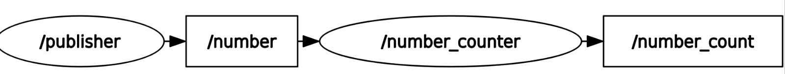
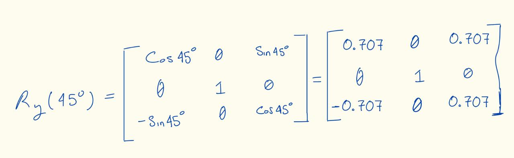
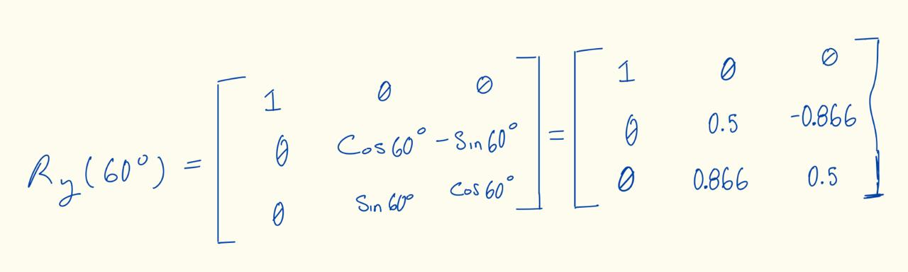
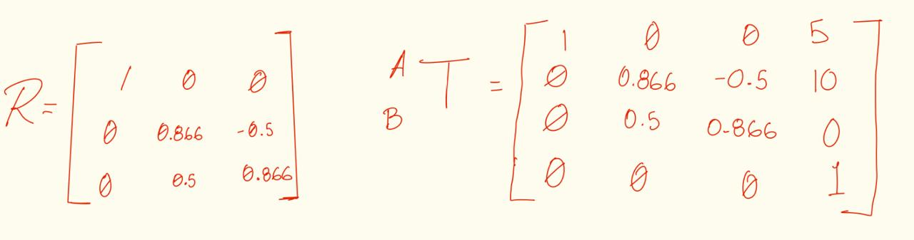
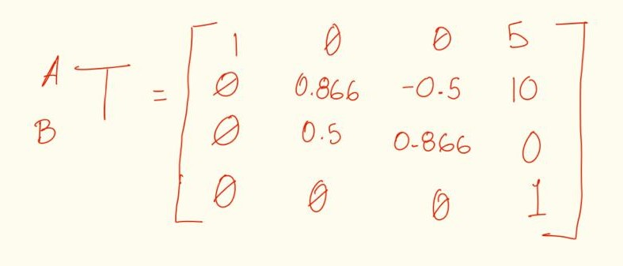
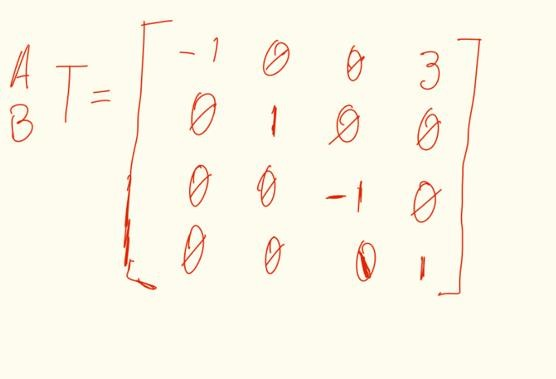
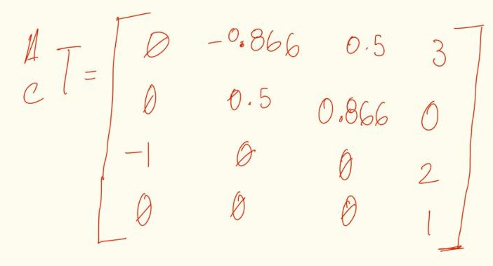

#  Work 2: Transform Nomenclature

- **Proyect:** Work 2: Transform Nomenclature
- **Equipo / Autor(es):** Isaac Antonio Pérez Alemán
- **Curso / Asignatura:** Applied Robotics
- **Fecha:** 21/02/2026

## 1) Activity Goals

- Understand the mathematical representation of point rotations in space.
  - Apply the left-multiplication rule for rotations about fixed reference axes.
  - Perform visual analysis of geometric diagrams to extract spatial data.
  - Integrate rotation and translation vectors into a single coordinate frame.

---

## 2) Materials

- No materials required.

## 3) Analysis

### Exercise 1:

First Rotation in YA with angle = 45 degrees.

<!-- Control de tamaño usando HTML (cuando se requiera) -->

Second Rotation in XA with angle = 60 degrees.

2) Matriz Rx(60°):
| 1 |  0.000 |  0.000 |
| 0 |  0.500 | -0.866 |
| 0 |  0.866 |  0.500 |

---

### Exercise 2: 

The frame B is rotating relative to A in X with angle = 30 degrees, with ApB origin = [5, 10, 0].

The rotation in X: we have an angle=30 degrees, we have to make the final matrix 

---

### Exercise 3: Analysis of Multiple Linear Displacements

For A_B T we have our origin in ApB origin [3, 0, 0].
So for our first translation we have:

For the second matrix (A_C T), we have to determinate the rotation of C relative to A, we have the origin of C in [3 0 2], so:

